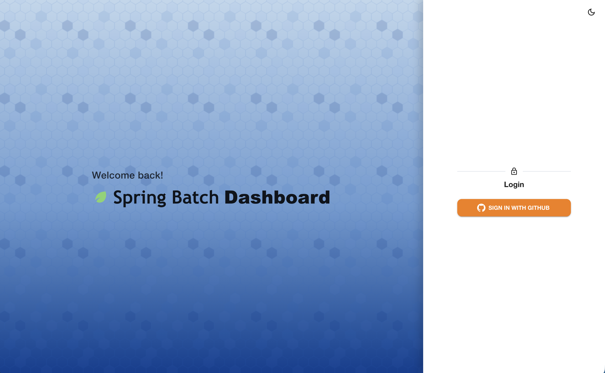
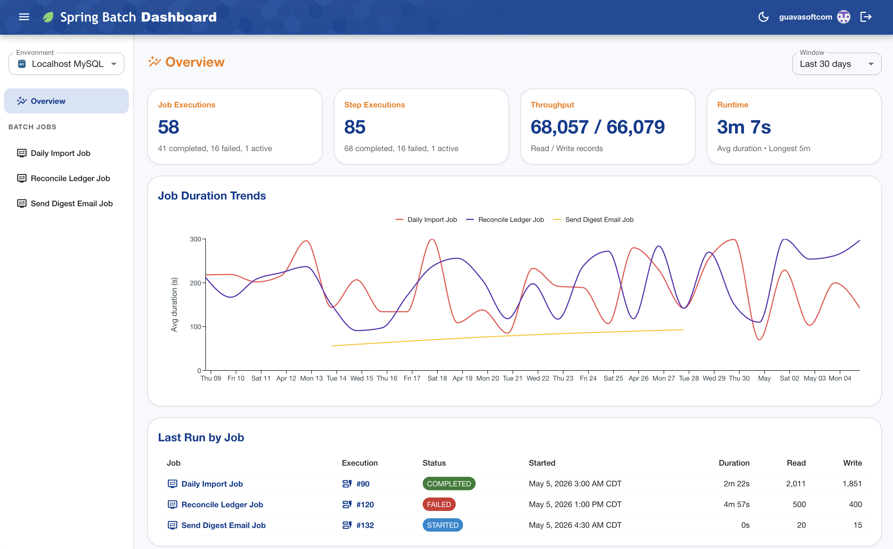
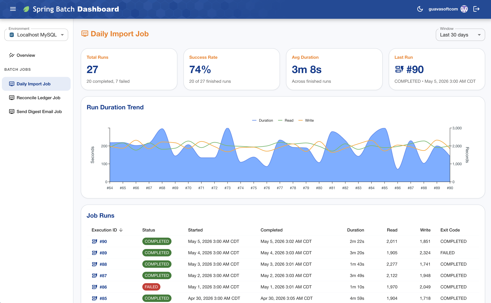
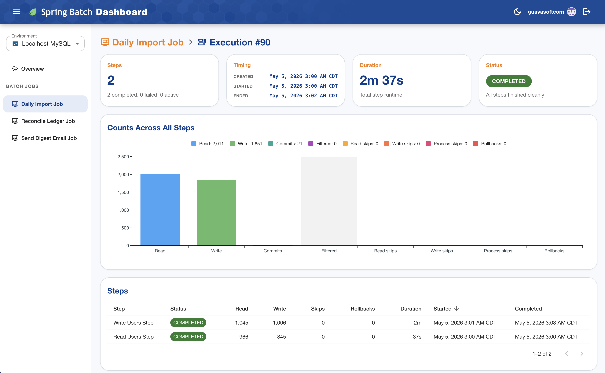
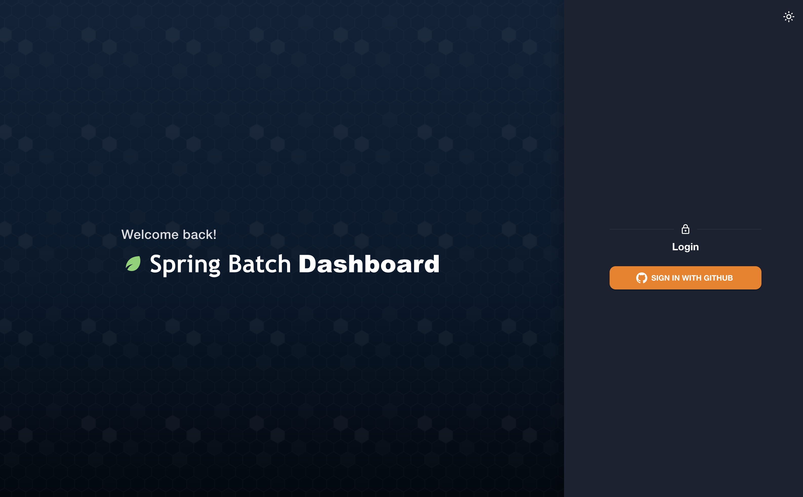
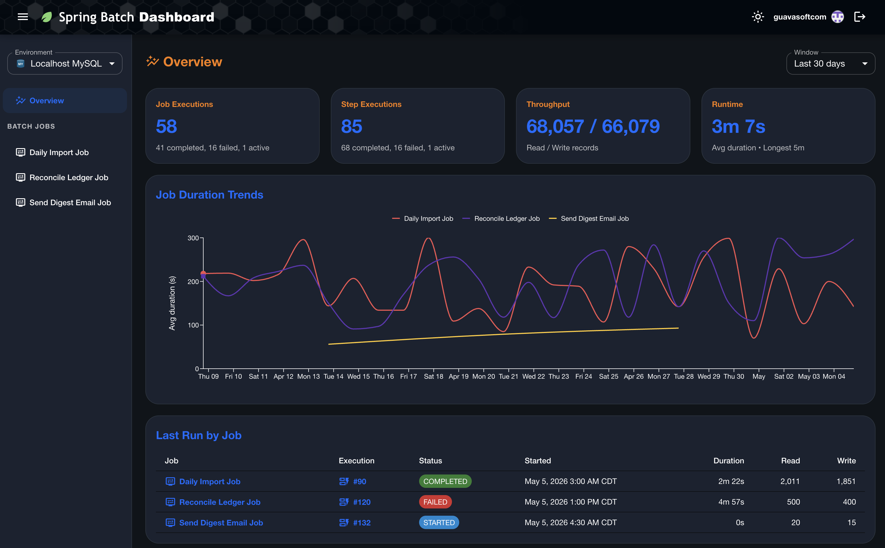
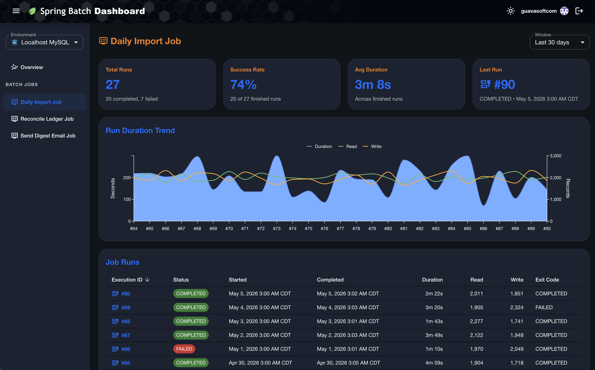
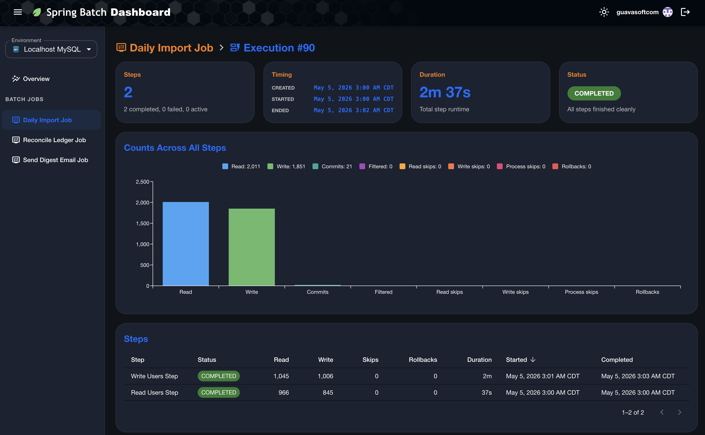
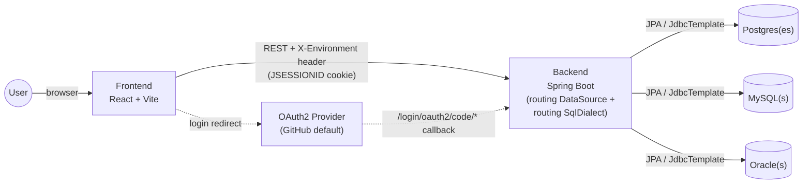

# Spring Batch Dashboard

[](https://github.com/guavasoftcom/spring-batch-dashboard/actions/workflows/pull-request.yml)
[](LICENSE)
[](https://openjdk.org/projects/jdk/21/)
[](https://spring.io/projects/spring-boot)
[](https://react.dev/)
[](https://yarnpkg.com/)
[](#ci)

A web dashboard for inspecting Spring Batch metadata (job runs, step executions, throughput, status distributions) across any mix of PostgreSQL, MySQL, and Oracle environments — all from a single deployment.

## What's in here

| Component | Stack | Purpose |
|---|---|---|
| [`backend/`](backend/) | Spring Boot 4, Java 21, Spring Data JPA, OAuth2 | REST API that reads `BATCH_*` metadata and serves it to the frontend. Multi-environment via per-request datasource routing; each `app.datasources` entry declares its own engine (POSTGRESQL / MYSQL / ORACLE) and a routing `SqlDialect` picks the right per-engine SQL on every call. All three JDBC drivers are bundled in one artifact. |
| [`frontend/`](frontend/) | React 19, Vite, MUI, TanStack Query, Vitest | The dashboard SPA. Browses jobs, runs, and per-execution step details. |

The components don't share code — they're independent apps that meet at the database.

## Screenshots

### Light mode

#### Login


#### Overview


#### Job Details


#### Job Execution


### Dark mode

#### Login


#### Overview


#### Job Details


#### Job Execution


## Quick start

You'll need: JDK 21, Node 20+, Yarn 4 (Berry), Docker.

```bash
# 1. Backend — pulls up Postgres + MySQL + Oracle in docker containers, serves on :8080
cd backend
cp .env.example .env                      # add GITHUB_CLIENT_ID / GITHUB_CLIENT_SECRET (and DB creds)
./mvnw spring-boot:run

# 2. Frontend — serves on :5173
cd ../frontend
yarn install
yarn dev
```

Open `http://localhost:5173` and log in. The backend's interactive API docs are at [`http://localhost:8080/swagger-ui/index.html`](http://localhost:8080/swagger-ui/index.html).

To run the dashboard without configuring OAuth or a database, set `VITE_USE_MOCK_DATA=true` in `frontend/.env` — every API endpoint serves canned data instead.

## Datasources

A single deployment can serve any combination of POSTGRESQL / MYSQL / ORACLE entries. Each `app.datasources` entry declares its own engine via `type`, and a routing `SqlDialect` picks the matching per-engine SQL (epoch math, `NULLS LAST`, pagination clause, schema-init SQL) on every call. All three JDBC drivers are bundled in the same artifact — no build flag picks one.

```yaml
app:
  datasources:
    - name: prod-postgres
      type: POSTGRESQL
      url: jdbc:postgresql://…
      username: …
      password: …
    - name: prod-mysql
      type: MYSQL
      url: jdbc:mysql://…
      username: …
      password: …
    - name: prod-oracle
      type: ORACLE
      url: jdbc:oracle:thin:@//…
      username: …
      password: …
      schema: BATCH_PROD          # optional; applied as connection-init SQL per-dialect
```

The local dev profile ([`application-local.yml`](backend/src/main/resources/application-local.yml)) ships one entry per engine pointing at the matching `docker compose` container, so a fresh `./mvnw spring-boot:run` already exposes Postgres + MySQL + Oracle to the UI.

> **Hibernate caveat.** Hibernate detects its dialect once on the first JDBC connection and caches it for the SessionFactory, so `Pageable`-driven JPA queries use whichever pagination syntax the *first* datasource implies (PG/MySQL share `LIMIT … OFFSET …`, Oracle differs). Anything cross-engine belongs in a JdbcTemplate fragment that goes through `SqlDialect`. Details in [backend/AGENTS.md](backend/AGENTS.md#hibernate-caveat).

## Multi-environment selector

The frontend's environment selector lists every `app.datasources` entry. The selection is forwarded to the backend on every request as the `X-Environment` header, and a routing `DataSource` plus a routing `SqlDialect` dispatch to the matching pool and per-engine SQL.

To add a new environment, append an entry to `app.datasources` (any engine; just set `type`) and restart. The selector picks it up via `GET /api/environments`, which returns `[{ name, type }]` — `type` drives the database icon shown next to the environment name in the selector and the page breadcrumb.

## Authentication

OAuth2 via Spring Security; defaults wire up GitHub but any provider works by remapping attribute names under `app.auth.attributes.*` (e.g. for Google: `login=email`, `avatar-url=picture`). An optional comma-delimited `app.auth.allowed-logins` allow-list rejects logins outside the list at OAuth2 user-loading time.

## Architecture



- **Backend** never writes to the BATCH_* schema — read-only.
- **Frontend** persists the chosen environment to `localStorage` and forwards it on every request as `X-Environment`.
- **Routing** — `AbstractRoutingDataSource` uses a `ThreadLocal` populated from `X-Environment` to pick the pool; `RoutingSqlDialect` reads the same key to pick the matching per-engine SQL. A single boot serves any mix of POSTGRESQL / MYSQL / ORACLE entries.
- **OAuth2** flow: the frontend opens the provider login; the provider posts back to the backend's callback; the backend establishes a session (`JSESSIONID`) and redirects to `app.oauth2.success-url`. Subsequent API calls authenticate via the cookie. The provider is configurable via Spring Security; attribute-name mapping and an optional `app.auth.allowed-logins` allow-list make it provider-agnostic (see [Authentication](#authentication)).

## Documentation

Each component has its own conventions doc:

- [AGENTS.md](AGENTS.md) — repo overview, runbook, cross-cutting conventions.
- [backend/AGENTS.md](backend/AGENTS.md) — controller/service/repository patterns, dialect strategy, dynamic datasource routing, MapStruct setup, error handling.
- [frontend/AGENTS.md](frontend/AGENTS.md) — page/tile container conventions, shared component inventory, query-hook pattern, alias setup.

## Tooling notes

- Backend uses Maven via the wrapper (`./mvnw`); never `mvn` directly.
- Frontend uses Yarn 4 (Berry) with the `node-modules` linker. `package-lock.json` is gitignored — don't run `npm install`.
- Tests: `./mvnw test` boots one Testcontainer per engine (Postgres + MySQL + Oracle) and parameterizes repository tests across all three; `yarn test` / `yarn test:coverage` on the frontend.
- Coverage gate is **80%** on both sides. Backend uses JaCoCo (gated by [`PavanMudigonda/jacoco-reporter`](.github/workflows/pull-request.yml)); frontend uses vitest's `coverage.thresholds` ([`frontend/vite.config.ts`](frontend/vite.config.ts)). Both post sticky PR comments.
- Imports in the frontend use the `~/` alias to `src/`; siblings stay relative.
- Backend errors never leak SQL or class names to clients (see [GlobalExceptionHandler](backend/src/main/java/com/guavasoft/springbatch/dashboard/config/GlobalExceptionHandler.java)).
- Backend Java naming: prefer expressive variable names (`throughputBars` over `bars`); short names are fine only for lambda parameters and generic type parameters. Captured in [backend/AGENTS.md](backend/AGENTS.md#conventions).

## CI

The PR workflow ([`.github/workflows/pull-request.yml`](.github/workflows/pull-request.yml)) runs two jobs:

1. **Backend** — Checkstyle, Surefire, JaCoCo agent, Maven package. Boots all three Testcontainers in one run so repository tests exercise every dialect; uploads Surefire + JaCoCo reports, posts a JUnit check + comment, and gates coverage at 80% via [`PavanMudigonda/jacoco-reporter`](.github/workflows/pull-request.yml) against `target/site/jacoco/jacoco.xml`.
2. **Frontend** — lint (with ESLint annotations), `tsc -b` + Vite build, vitest with coverage, JUnit + coverage PR comments.

JDK and Node setup are extracted into composite actions at [`.github/actions/setup-java`](.github/actions/setup-java/action.yml) and [`.github/actions/setup-node`](.github/actions/setup-node/action.yml) so the toolchain version lives in one place.

## Releases

Releases are cut by manually dispatching [`.github/workflows/release.yml`](.github/workflows/release.yml) ("Run workflow" → pick `patch` / `minor` / `major`). The workflow:

1. Reads the current version from [`frontend/package.json`](frontend/package.json) and computes the next semver per the chosen bump.
2. Updates `frontend/package.json` (numeric) and `backend/pom.xml` (with the `-SNAPSHOT` qualifier) in lockstep.
3. Commits the bump to `main`, tags `vX.Y.Z`, and creates a GitHub Release with auto-generated notes.

The push and tag run as a dedicated GitHub App (not `github-actions[bot]`), so the App can be added to the bypass list of any Ruleset / branch-protection rule. Required repo secrets: `RELEASE_APP_ID`, `RELEASE_APP_PRIVATE_KEY`. The job is gated by the `Release` GitHub Environment (configure its **Deployment branches** to `main`-only) and additionally guards against `github.ref != refs/heads/main`.

## License

Licensed under the [Apache License, Version 2.0](LICENSE). See the [`LICENSE`](LICENSE) file for the full text.
