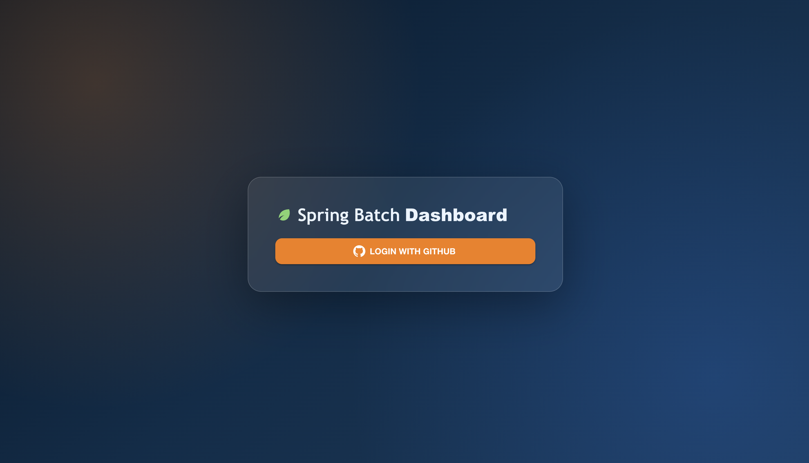
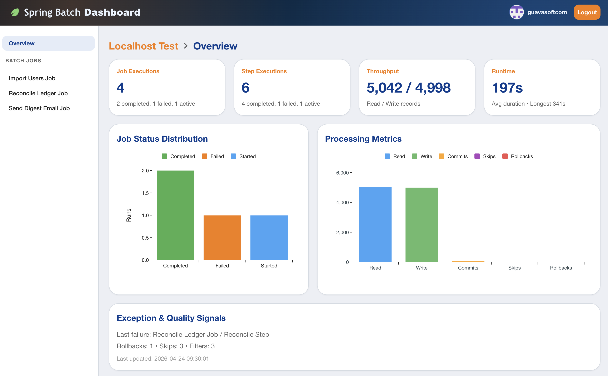
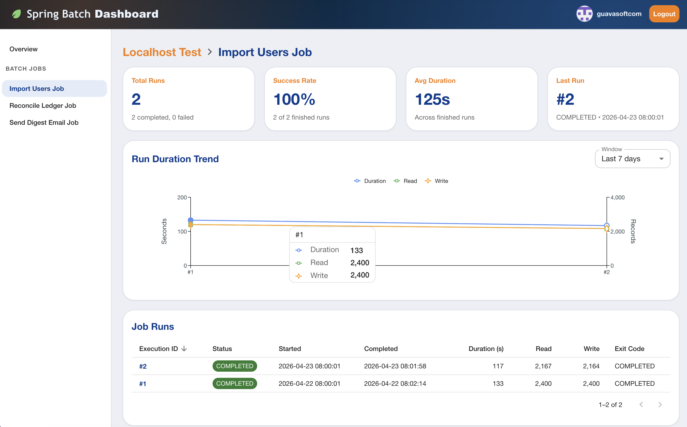
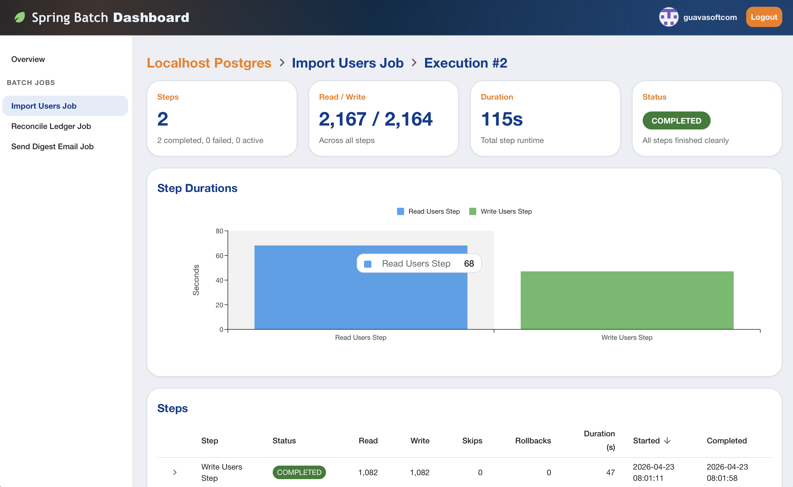
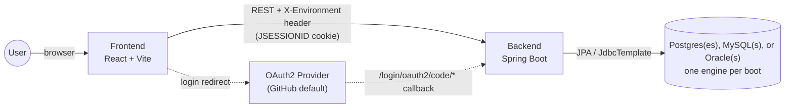

# Spring Batch Dashboard

A web dashboard for inspecting Spring Batch metadata (job runs, step executions, throughput, status distributions) across multiple PostgreSQL, MySQL, **or** Oracle environments.

## What's in here

| Component | Stack | Purpose |
|---|---|---|
| [`backend/`](backend/) | Spring Boot 4, Java 21, Spring Data JPA, OAuth2 | REST API that reads `BATCH_*` metadata and serves it to the frontend. Multi-environment via per-request datasource routing; supports Postgres, MySQL, or Oracle (one engine per boot, picked via Maven profile). |
| [`frontend/`](frontend/) | React 19, Vite, MUI, TanStack Query, Vitest | The dashboard SPA. Browses jobs, runs, and per-execution step details. |

The components don't share code — they're independent apps that meet at the database.

## Screenshots

### Login


### Overview


### Job Details


### Job Execution


## Quick start

You'll need: JDK 21, Node 20+, Yarn 4 (Berry), Docker.

```bash
# 1. Backend — pulls up Postgres + MySQL in docker containers, serves on :8080
cd backend
cp .env.example .env                      # add GITHUB_CLIENT_ID / GITHUB_CLIENT_SECRET (and DB creds)

./mvnw spring-boot:run                    # Postgres (default)
# or:
./mvnw -Pmysql spring-boot:run            # MySQL
./mvnw -Poracle spring-boot:run           # Oracle

# 2. Frontend — serves on :5173
cd ../frontend
yarn install
yarn dev
```

Open `http://localhost:5173` and log in. The backend's interactive API docs are at [`http://localhost:8080/swagger-ui/index.html`](http://localhost:8080/swagger-ui/index.html).

To run the dashboard without configuring OAuth or a database, set `VITE_USE_MOCK_DATA=true` in `frontend/.env` — every API endpoint serves canned data instead.

## Choosing the database engine

The Maven profile is the single switch. It bundles the right JDBC driver, sets `app.dialect`, and activates the matching local config:

| | Postgres (default) | MySQL | Oracle |
|---|---|---|---|
| Build / run | `./mvnw …` | `./mvnw -Pmysql …` | `./mvnw -Poracle …` |
| Active config | [`application-local-postgresql.yml`](backend/src/main/resources/application-local-postgresql.yml) | [`application-local-mysql.yml`](backend/src/main/resources/application-local-mysql.yml) | [`application-local-oracle.yml`](backend/src/main/resources/application-local-oracle.yml) |
| Driver | `org.postgresql:postgresql` | `com.mysql:mysql-connector-j` | `com.oracle.database.jdbc:ojdbc11` |

Mixing engines in one boot is not supported — every entry under `app.datasources` must match the active engine. Engine-specific SQL (epoch math, `NULLS LAST`) is routed through the [`SqlDialect`](backend/src/main/java/com/guavasoft/springbatch/dashboard/dialect/SqlDialect.java) strategy so repository code stays portable.

## Multi-environment

The dashboard supports browsing multiple databases of the active engine, switched via the environment selector in the sidebar. The selection is forwarded to the backend on every request as the `X-Environment` header, and the backend routes to the matching datasource at `app.datasources[*]` in the active local-profile YAML.

To add a new environment, append an entry to that list (matching the active engine) and restart. The selector picks it up via `GET /api/environments`.

## Authentication

OAuth2 via Spring Security; defaults wire up GitHub but any provider works by remapping attribute names under `app.auth.attributes.*` (e.g. for Google: `login=email`, `avatar-url=picture`). An optional comma-delimited `app.auth.allowed-logins` allow-list rejects logins outside the list at OAuth2 user-loading time.

## Architecture



- **Backend** never writes to the BATCH_* schema — read-only.
- **Frontend** persists the chosen environment to `localStorage` and forwards it on every request as `X-Environment`.
- **OAuth2** flow: the frontend opens the provider login; the provider posts back to the backend's callback; the backend establishes a session (`JSESSIONID`) and redirects to `app.oauth2.success-url`. Subsequent API calls authenticate via the cookie. The provider is configurable via Spring Security; attribute-name mapping and an optional `app.auth.allowed-logins` allow-list make it provider-agnostic (see [Authentication](#authentication)).

## Documentation

Each component has its own conventions doc:

- [AGENTS.md](AGENTS.md) — repo overview, runbook, cross-cutting conventions.
- [backend/AGENTS.md](backend/AGENTS.md) — controller/service/repository patterns, engine selection, dialect strategy, dynamic datasource routing, MapStruct setup, error handling.
- [frontend/AGENTS.md](frontend/AGENTS.md) — page/tile container conventions, shared component inventory, query-hook pattern, alias setup.

## Tooling notes

- Backend uses Maven via the wrapper (`./mvnw`); never `mvn` directly.
- Frontend uses Yarn 4 (Berry) with the `node-modules` linker. `package-lock.json` is gitignored — don't run `npm install`.
- Tests: `./mvnw test` (Postgres) / `./mvnw -Pmysql test` (MySQL) / `./mvnw -Poracle test` (Oracle); `yarn test` / `yarn test:coverage` on the frontend. CI runs all three backend engines as a matrix.
- Coverage gate is **80%** on both sides. Backend uses JaCoCo (per-matrix exec files merged in CI, gated by [`PavanMudigonda/jacoco-reporter`](.github/workflows/pull-request.yml)); frontend uses vitest's `coverage.thresholds` ([`frontend/vite.config.ts`](frontend/vite.config.ts)). Both post sticky PR comments.
- Imports in the frontend use the `~/` alias to `src/`; siblings stay relative.
- Backend errors never leak SQL or class names to clients (see [GlobalExceptionHandler](backend/src/main/java/com/guavasoft/springbatch/dashboard/config/GlobalExceptionHandler.java)).
- Backend Java naming: prefer expressive variable names (`throughputBars` over `bars`); short names are fine only for lambda parameters and generic type parameters. Captured in [backend/AGENTS.md](backend/AGENTS.md#conventions).

## CI

The PR workflow ([`.github/workflows/pull-request.yml`](.github/workflows/pull-request.yml)) runs three jobs:

1. **Backend matrix** — Postgres + MySQL + Oracle builds in parallel: Checkstyle, Surefire, JaCoCo agent, Maven package. Per-matrix it annotates checkstyle violations, posts a JUnit check + comment, and uploads the `jacoco.exec` and per-profile HTML report.
2. **Backend coverage (merged)** — downloads all matrix exec files, merges them into a single report, and runs the 80% gate against the union plus a per-package per-counter PR comment.
3. **Frontend** — lint (with ESLint annotations), `tsc -b` + Vite build, vitest with coverage, JUnit + coverage PR comments.
