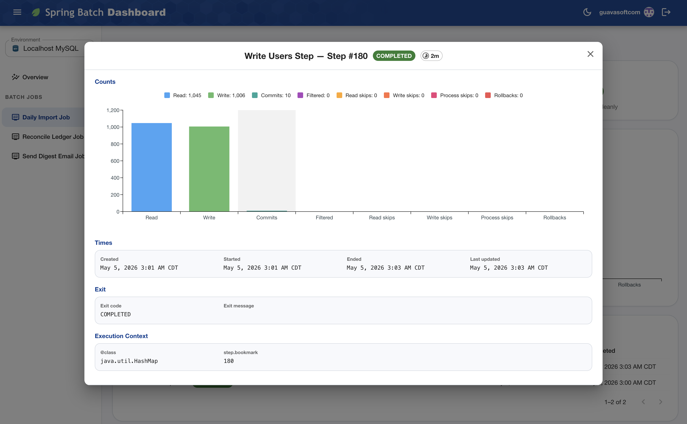
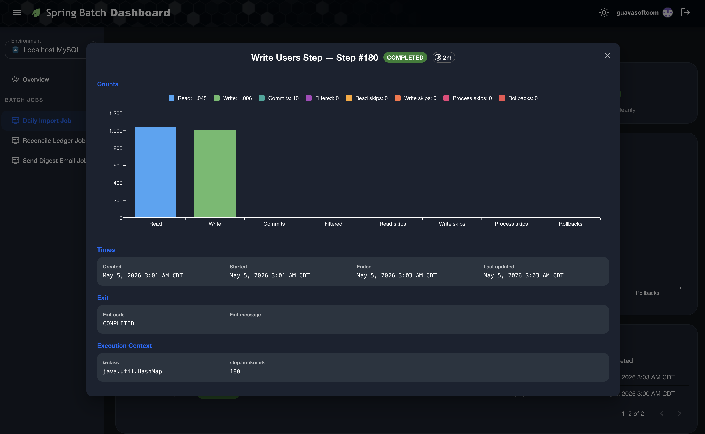
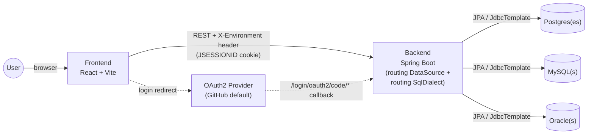

# Spring Batch Dashboard

<!-- Project status -->
[](https://github.com/guavasoftcom/spring-batch-dashboard/actions/workflows/pull-request.yml)
[](https://github.com/guavasoftcom/spring-batch-dashboard/releases)
[](https://github.com/guavasoftcom/spring-batch-dashboard/pkgs/container/spring-batch-dashboard)
[](LICENSE)
[](#ci)

<!-- Tech stack -->
[](https://openjdk.org/projects/jdk/21/)
[](https://spring.io/projects/spring-boot)
[](https://react.dev/)
[](https://www.typescriptlang.org/)
[](https://vitejs.dev/)
[](https://yarnpkg.com/)

<!-- Database support -->
[](#datasources)
[](#datasources)
[](#datasources)
[](#datasources)

A web dashboard for inspecting Spring Batch metadata (job runs, step executions, throughput, status distributions) across any mix of PostgreSQL, MySQL, Oracle, and SQL Server environments — all from a single deployment.

## What's in here

| Component                | Stack                                           | Purpose                                                                                                                                                                                                                                                                                                                                     |
| ------------------------ | ----------------------------------------------- | ------------------------------------------------------------------------------------------------------------------------------------------------------------------------------------------------------------------------------------------------------------------------------------------------------------------------------------------- |
| [`backend/`](backend/)   | Spring Boot 4, Java 21, Spring Data JPA, OAuth2 | REST API that reads `BATCH_*` metadata and serves it to the frontend. Multi-environment via per-request datasource routing; each `app.datasources` entry declares its own engine (POSTGRESQL / MYSQL / ORACLE / SQLSERVER) and a routing `SqlDialect` picks the right per-engine SQL on every call. All four JDBC drivers are bundled in one artifact. |
| [`frontend/`](frontend/) | React 19, Vite, MUI, TanStack Query, Vitest     | The dashboard SPA. Browses jobs, runs, and per-execution step details.                                                                                                                                                                                                                                                                      |

The components don't share code — they're independent apps that meet at the database.

## Screenshots

### Light mode

#### Login


#### Overview


#### Job Details


#### Job Execution


#### Job Execution Step Modal



### Dark mode

#### Login


#### Overview


#### Job Details


#### Job Execution


#### Job Execution Step Modal



## Quick start

You'll need: JDK 21, Node 20+, Yarn 4 (Berry), Docker.

```bash
# 1. Backend — pulls up Postgres + MySQL + Oracle in docker containers, serves on :8080
cd backend
cp .env.example .env                      # add GITHUB_CLIENT_ID / GITHUB_CLIENT_SECRET (and DB creds)
./mvnw spring-boot:run

# 2. Frontend — serves on :5173
cd ../frontend
yarn install
yarn dev
```

Open `http://localhost:5173` and log in. The backend's interactive API docs are at [`http://localhost:8080/swagger-ui/index.html`](http://localhost:8080/swagger-ui/index.html).

To run the dashboard without configuring OAuth or a database, set `VITE_USE_MOCK_DATA=true` in `frontend/.env` — every API endpoint serves canned data instead.

## Running the published image

Each release publishes a single image to GHCR — Spring Boot serves the API and the SPA from the same origin on `:8080`. Pull a tag:

```bash
docker pull ghcr.io/guavasoftcom/spring-batch-dashboard:latest
```

Configuration is via environment variables; Spring Boot's relaxed binding maps env vars onto the same `app.*` / `spring.*` properties used in [`application-local.yml`](backend/src/main/resources/application-local.yml). The mapping rule is: lowercase becomes uppercase, `.` and `-` both become `_`, and list indices are surrounded by `_` (so `app.datasources[0].name` → `APP_DATASOURCES_0_NAME`). The minimum env-var set covers one OAuth2 client registration, one `app.datasources[*]` entry, and `APP_OAUTH2_SUCCESS_URL`; both lists scale by adding more indexed (`APP_DATASOURCES_1_*`, …) or keyed (`SPRING_SECURITY_OAUTH2_CLIENT_REGISTRATION_<id>_*`) entries — see [Datasources](#datasources) and [Authentication](#authentication) for the property reference.

A complete, runnable example for **AKS** lives in [`deploy/aks/`](deploy/aks/) — Namespace + ConfigMap + Secret + Deployment + Service + AGIC Ingress, plus a [`deploy/aks/README.md`](deploy/aks/README.md) that walks through prerequisites, how to add more datasources/providers, and the upgrade path from a plain `Secret` to Azure Key Vault via the Secrets Store CSI driver. Apply with `kubectl apply -k deploy/aks/` after editing the placeholder values.

To smoke-test the combined Docker image locally (same artifact CI publishes to GHCR), run [`scripts/build-image.sh`](scripts/build-image.sh) then [`scripts/run-image-local.sh`](scripts/run-image-local.sh) — the first wraps the SPA-into-JAR repackage and `docker build`, the second runs the resulting image with the `local` Spring profile and your host's `docker compose` databases.

## Datasources

A single deployment can serve any combination of POSTGRESQL / MYSQL / ORACLE / SQLSERVER entries. Each `app.datasources` entry declares its own engine via `type`, and a routing `SqlDialect` picks the matching per-engine SQL (epoch math, `NULLS LAST`, pagination clause, schema-init SQL) on every call. All four JDBC drivers are bundled in the same artifact — no build flag picks one.

```yaml
app:
  datasources:
    - name: prod-postgres
      type: POSTGRESQL
      url: jdbc:postgresql://…
      username: …
      password: …
    - name: prod-mysql
      type: MYSQL
      url: jdbc:mysql://…
      username: …
      password: …
    - name: prod-oracle
      type: ORACLE
      url: jdbc:oracle:thin:@//…
      username: …
      password: …
      schema: BATCH_PROD # optional; applied as connection-init SQL per-dialect
      timezone: America/New_York # optional; defaults to UTC
    - name: prod-sqlserver
      type: SQLSERVER
      url: jdbc:sqlserver://…;databaseName=batch;encrypt=true
      username: …
      password: …
```

`schema` is honored on Postgres (`search_path`) and Oracle (`CURRENT_SCHEMA`); MySQL and SQL Server ignore it (the database in the JDBC URL plays that role, and on SQL Server the `BATCH_*` tables must live in the user's default schema, typically `dbo`).

The local dev profile ([`application-local.yml`](backend/src/main/resources/application-local.yml)) ships one entry per engine pointing at the matching `docker compose` container, so a fresh `./mvnw spring-boot:run` already exposes Postgres + MySQL + Oracle + SQL Server to the UI.

Timestamp fields in API responses are emitted as ISO-8601 UTC instants (`2026-04-30T14:30:00Z`), computed from each datasource's configured `timezone` (default `UTC`); the frontend renders them in the browser's local zone.

> **Hibernate caveat.** Hibernate detects its dialect once on the first JDBC connection and caches it for the SessionFactory, so `Pageable`-driven JPA queries use whichever pagination syntax the _first_ datasource implies (PG/MySQL share `LIMIT … OFFSET …`; Oracle and SQL Server use `OFFSET … ROWS FETCH NEXT …`). Anything cross-engine belongs in a JdbcTemplate fragment that goes through `SqlDialect`. Details in [backend/AGENTS.md](backend/AGENTS.md#hibernate-caveat).

## Multi-environment selector

The frontend's environment selector lists every `app.datasources` entry. The selection is forwarded to the backend on every request as the `X-Environment` header, and a routing `DataSource` plus a routing `SqlDialect` dispatch to the matching pool and per-engine SQL.

To add a new environment, append an entry to `app.datasources` (any engine; just set `type`) and restart. The selector picks it up via `GET /api/environments`, which returns `[{ name, type }]` — `type` drives the database icon shown next to the environment name in the selector and the page breadcrumb.

## Authentication

OAuth2 via Spring Security; defaults wire up GitHub but any provider works by remapping attribute names under `app.auth.attributes.*` (e.g. for Google: `login=email`, `avatar-url=picture`). An optional comma-delimited `app.auth.allowed-logins` allow-list rejects logins outside the list at OAuth2 user-loading time.

The login page renders one button per configured Spring Security registration by reading `GET /api/auth/providers`. Per-button display (label, background color, icon URL — `http(s)` or `data:` URI) is configured under `app.oauth2.buttons.<registrationId>`; missing keys fall back to a capitalized registration id and unstyled defaults.

## Architecture



- **Backend** never writes to the BATCH\_\* schema — read-only.
- **Frontend** persists the chosen environment to `localStorage` and forwards it on every request as `X-Environment`.
- **Routing** — `AbstractRoutingDataSource` uses a `ThreadLocal` populated from `X-Environment` to pick the pool; `RoutingSqlDialect` reads the same key to pick the matching per-engine SQL. A single boot serves any mix of POSTGRESQL / MYSQL / ORACLE entries.
- **OAuth2** flow: the frontend opens the provider login; the provider posts back to the backend's callback; the backend establishes a session (`JSESSIONID`) and redirects to `app.oauth2.success-url`. Subsequent API calls authenticate via the cookie. The provider is configurable via Spring Security; attribute-name mapping and an optional `app.auth.allowed-logins` allow-list make it provider-agnostic (see [Authentication](#authentication)).

## Documentation

Each component has its own conventions doc:

- [AGENTS.md](AGENTS.md) — repo overview, runbook, cross-cutting conventions.
- [backend/AGENTS.md](backend/AGENTS.md) — controller/service/repository patterns, dialect strategy, dynamic datasource routing, MapStruct setup, error handling.
- [frontend/AGENTS.md](frontend/AGENTS.md) — page/tile container conventions, shared component inventory, query-hook pattern, alias setup.

## Tooling notes

- Backend uses Maven via the wrapper (`./mvnw`); never `mvn` directly.
- Frontend uses Yarn 4 (Berry) with the `node-modules` linker. `package-lock.json` is gitignored — don't run `npm install`.
- Pre-commit secret scan via [pre-commit](https://pre-commit.com) + [gitleaks](https://github.com/gitleaks/gitleaks). One-time setup per clone: `brew install pre-commit` (or `pipx install pre-commit`) then `pre-commit install`. Every `git commit` then scans staged content for API keys, tokens, JWTs, etc., and blocks the commit on a hit. The hook config is [`.pre-commit-config.yaml`](.pre-commit-config.yaml). For deeper, contextual review (auth flows, accidental debug logs, etc.) run the `/security-review` skill on demand before opening a PR.
- Tests: `./mvnw test` boots one Testcontainer per engine (Postgres + MySQL + Oracle) and parameterizes repository tests across all three; `yarn test` / `yarn test:coverage` on the frontend.
- Coverage gate is **80%** on both sides. Backend uses JaCoCo (gated by [`PavanMudigonda/jacoco-reporter`](.github/workflows/pull-request.yml)); frontend uses vitest's `coverage.thresholds` ([`frontend/vite.config.ts`](frontend/vite.config.ts)). Both post sticky PR comments.
- Imports in the frontend use the `~/` alias to `src/`; siblings stay relative.
- Backend errors never leak SQL or class names to clients (see [GlobalExceptionHandler](backend/src/main/java/com/guavasoft/springbatch/dashboard/config/GlobalExceptionHandler.java)).
- Backend Java naming: prefer expressive variable names (`throughputBars` over `bars`); short names are fine only for lambda parameters and generic type parameters. Captured in [backend/AGENTS.md](backend/AGENTS.md#conventions).

## CI

The PR workflow ([`.github/workflows/pull-request.yml`](.github/workflows/pull-request.yml)) runs two jobs:

1. **Backend** — Checkstyle, Surefire, JaCoCo agent, Maven package. Boots all three Testcontainers in one run so repository tests exercise every dialect; uploads Surefire + JaCoCo reports, posts a JUnit check + comment, and gates coverage at 80% via [`PavanMudigonda/jacoco-reporter`](.github/workflows/pull-request.yml) against `target/site/jacoco/jacoco.xml`.
2. **Frontend** — lint (with ESLint annotations), `tsc -b` + Vite build, vitest with coverage, JUnit + coverage PR comments.

JDK and Node setup are extracted into composite actions at [`.github/actions/setup-java`](.github/actions/setup-java/action.yml) and [`.github/actions/setup-node`](.github/actions/setup-node/action.yml) so the toolchain version lives in one place. The full per-side gate (Checkstyle + tests + package + JaCoCo, and lint + typecheck + build + coverage) lives in [`.github/actions/verify-backend`](.github/actions/verify-backend/action.yml) and [`.github/actions/verify-frontend`](.github/actions/verify-frontend/action.yml) so the release workflow runs the same checks PR review does.

## Releases

Releases are cut by manually dispatching [`.github/workflows/release.yml`](.github/workflows/release.yml) ("Run workflow" → pick `patch` / `minor` / `major`). The workflow:

1. Runs the same gates as PR review (`verify-backend` + `verify-frontend`); a failure aborts before any commit, tag, or image is created.
2. Reads the current version from [`frontend/package.json`](frontend/package.json) and computes the next semver per the chosen bump.
3. Updates `frontend/package.json` (numeric) and `backend/pom.xml` (with the `-SNAPSHOT` qualifier) in lockstep.
4. Commits the bump to `main` and tags `vX.Y.Z`.
5. Bundles the freshly-built SPA into Spring Boot's `classpath:/static/`, repackages the JAR, then builds and pushes a Docker image to `ghcr.io/<owner>/<repo>:vX.Y.Z` and `:latest` via the root [`Dockerfile`](Dockerfile) — auth uses the workflow's `GITHUB_TOKEN` with `packages: write`, no extra secrets.
6. Creates a GitHub Release with auto-generated notes.

See [Running the published image](#running-the-published-image) for how to pull and configure the resulting image, and [`deploy/aks/`](deploy/aks/) for a runnable AKS bundle.

The push and tag run as a dedicated GitHub App (not `github-actions[bot]`), so the App can be added to the bypass list of any Ruleset / branch-protection rule. Required repo secrets: `RELEASE_APP_ID`, `RELEASE_APP_PRIVATE_KEY`. The job is gated by the `Release` GitHub Environment (configure its **Deployment branches** to `main`-only) and additionally guards against `github.ref != refs/heads/main`.

## Useful resources

### Backend

- [Spring Boot reference](https://docs.spring.io/spring-boot/reference/index.html) — auto-configuration, externalized configuration, profiles. The whole [`backend/`](backend/) module is conventional Spring Boot 4.
- [Spring Framework reference](https://docs.spring.io/spring-framework/reference/index.html) — Spring MVC and DI under Spring Boot; relevant when stepping outside Spring Boot's autoconfiguration.
- [Spring Data JPA reference](https://docs.spring.io/spring-data/jpa/reference/index.html) — repository derivation, paging/sorting, JPQL. The dashboard uses entity-based reads against `BATCH_*` tables (see [`backend/AGENTS.md`](backend/AGENTS.md)).
- [Hibernate User Guide](https://docs.jboss.org/hibernate/orm/6.6/userguide/html_single/Hibernate_User_Guide.html) — JPA provider; relevant for the [Hibernate dialect caveat](#datasources) that affects mixed-engine deployments.
- [Spring Security OAuth2 client](https://docs.spring.io/spring-security/reference/servlet/oauth2/login/index.html) — registration vs. provider properties, attribute mapping, common-provider defaults (GitHub, Google, Facebook, Okta).
- [Spring Boot Actuator](https://docs.spring.io/spring-boot/reference/actuator/endpoints.html) — only the `health` endpoint is exposed; Kubernetes probe groups (`/actuator/health/{readiness,liveness}`) are wired up for the GHCR image.
- [SpringDoc OpenAPI](https://springdoc.org/) — generates the OpenAPI 3 spec and serves the Swagger UI at `/swagger-ui/index.html`.
- [MapStruct](https://mapstruct.org/documentation/stable/reference/html/) — compile-time entity → DTO mapping; mappers live under [`backend/src/main/java/.../mapper`](backend/src/main/java/com/guavasoft/springbatch/dashboard/mapper/).
- [Project Lombok](https://projectlombok.org/features/) — `@Getter`/`@Setter`/`@RequiredArgsConstructor` etc. used throughout `config/` and `model/`.
- [Testcontainers (Java)](https://java.testcontainers.org/) — boots real Postgres / MySQL / Oracle in Docker for repository tests so every dialect is exercised in CI.

### Frontend

- [React 19](https://react.dev/learn) — function components + hooks; the SPA's component model.
- [Vite](https://vitejs.dev/guide/) — dev server (`yarn dev`) and production bundler (`vite build`); config in [`frontend/vite.config.ts`](frontend/vite.config.ts).
- [TypeScript](https://www.typescriptlang.org/docs/) — strict mode, `tsc -b` typecheck gate in CI.
- [TanStack Query](https://tanstack.com/query/latest/docs/framework/react/overview) — server-state cache that powers every data-fetching tile; query hooks under [`frontend/src/api`](frontend/src/api/).
- [MUI (Material UI)](https://mui.com/material-ui/getting-started/) — component library and theming.
- [`@mui/x-charts`](https://mui.com/x/react-charts/) — charts on the Overview / Job Detail tiles; styling is centralized (see [`frontend/AGENTS.md`](frontend/AGENTS.md)).
- [`@mui/x-data-grid`](https://mui.com/x/react-data-grid/) — sortable / paginated tables for jobs and runs.
- [Formik](https://formik.org/docs/overview) — form state for the (small set of) input forms.
- [React Router](https://reactrouter.com/) — SPA routing; deep links are forwarded to `index.html` by the backend's `SpaController`.
- [Vitest](https://vitest.dev/guide/) + [Testing Library](https://testing-library.com/docs/react-testing-library/intro/) — unit / component tests; coverage gate at 80% via vitest's `coverage.thresholds`.
- [Yarn 4 (Berry)](https://yarnpkg.com/getting-started) — package manager; `node-modules` linker, no `npm install` (see [Tooling notes](#tooling-notes)).

### Database & Spring Batch

- [Spring Batch reference](https://docs.spring.io/spring-batch/reference/index.html) — the framework whose `BATCH_*` metadata schema this dashboard reads.
- [`BATCH_*` schema reference](https://docs.spring.io/spring-batch/reference/schema-appendix.html) — exact column definitions per engine, plus the table-creation DDL.
- [PostgreSQL JDBC driver](https://jdbc.postgresql.org/documentation/) — connection URL syntax, connection properties.
- [MySQL Connector/J](https://dev.mysql.com/doc/connector-j/en/) — JDBC driver; case-sensitivity caveats relevant to `BATCH_*` table names.
- [Oracle JDBC](https://docs.oracle.com/en/database/oracle/oracle-database/21/jjdbc/index.html) — `ojdbc11` driver; thin-client URL syntax.

### Build, CI, and release

- [Maven (with the wrapper)](https://maven.apache.org/guides/index.html) — `./mvnw` is the canonical entry point; never `mvn` directly.
- [JaCoCo](https://www.jacoco.org/jacoco/trunk/doc/) — backend code-coverage agent; 80% gate enforced via [`PavanMudigonda/jacoco-reporter`](https://github.com/PavanMudigonda/jacoco-reporter) in CI.
- [Checkstyle](https://checkstyle.sourceforge.io/) — backend style gate; configuration in [`backend/checkstyle.xml`](backend/checkstyle.xml).
- [GitHub Actions reference](https://docs.github.com/actions) — used for PR checks ([`.github/workflows/pull-request.yml`](.github/workflows/pull-request.yml)) and releases ([`.github/workflows/release.yml`](.github/workflows/release.yml)); composite actions live under [`.github/actions/`](.github/actions/).
- [GitHub Container Registry (GHCR)](https://docs.github.com/packages/working-with-a-github-packages-registry/working-with-the-container-registry) — release destination (`ghcr.io/guavasoftcom/spring-batch-dashboard`).
- [pre-commit](https://pre-commit.com/) + [gitleaks](https://github.com/gitleaks/gitleaks) — local secret-scan gate before each commit; config in [`.pre-commit-config.yaml`](.pre-commit-config.yaml).
- [Mermaid](https://mermaid.js.org/intro/) — the [Architecture](#architecture) diagram is a Mermaid `flowchart`.

### Deployment

- [`deploy/aks/`](deploy/aks/) — runnable Kubernetes manifests for AKS; the [`deploy/aks/README.md`](deploy/aks/README.md) has its own resources section with AKS-specific links (AGIC, Workload Identity, Key Vault CSI, cert-manager).
- [Spring Boot externalized configuration](https://docs.spring.io/spring-boot/reference/features/external-config.html) — the relaxed-binding rules that map env vars onto `app.*` / `spring.*` properties (see [Running the published image](#running-the-published-image)).
- [Docker reference](https://docs.docker.com/reference/) — the root [`Dockerfile`](Dockerfile) uses the layered-jar pattern (`-Djarmode=layertools extract`) for better cache hits across releases.

## License

Licensed under the [Apache License, Version 2.0](LICENSE). See the [`LICENSE`](LICENSE) file for the full text.
